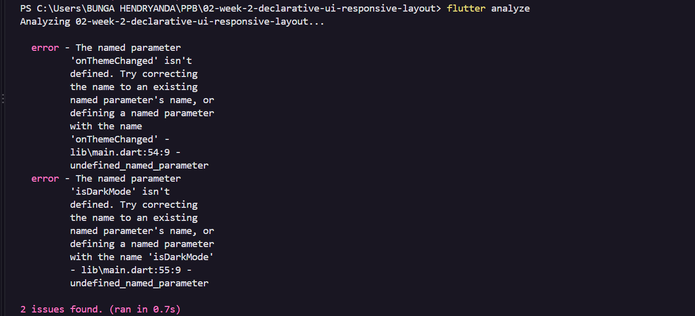
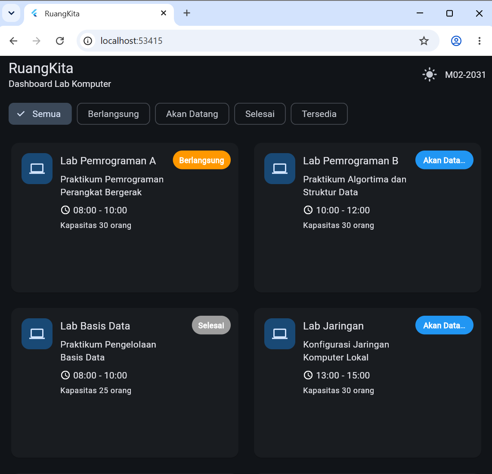
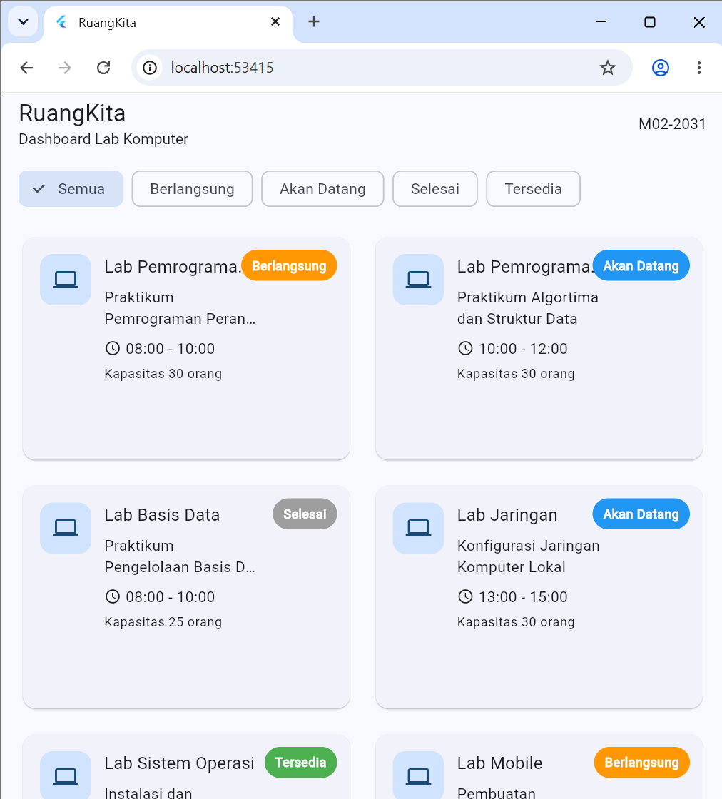
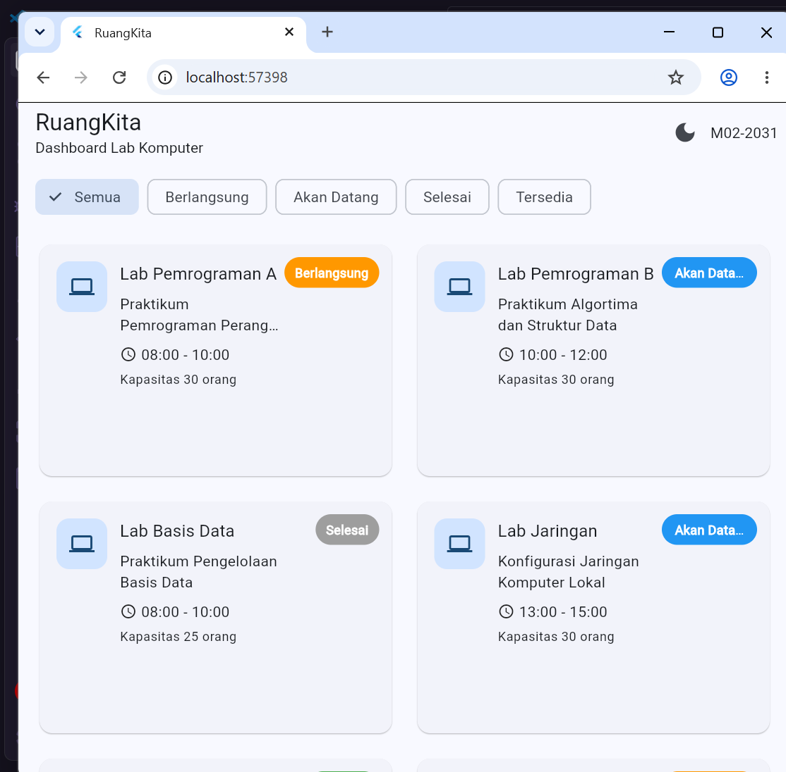

# Debug Notes

## Masalah 1 - Tombol Light/Dark Mode Belum Berfungsi

### Gejala

Pas saya menambahkan fitur Light Mode dan Dark Mode, muncul error saat menjalankan perintah `flutter analyze` di terminal.

Error yang muncul seperti ini:

```text
The named parameter 'onThemeChanged' isn't defined.
The named parameter 'isDarkMode' isn't defined.
```

Tombol buat mengganti temanya juga belum bisa dipakai karena halaman Lab Komputer belum menerima fungsi untuk mengubah tema yang dikirim dari file `main.dart`.

### Screenshot Sebelum Perbaikan



### Dugaan Penyebab

Di kode awal, halaman utama aplikasinya masih menggunakan class `LabKomputer`. Class ini ternyata belum dibuatkan parameter `onThemeChanged` dan `isDarkMode`. 

Sementara itu, di file `main.dart` saya sudah telanjur mengirimkan kedua parameter tersebut ke halaman utama. Karena parameter di class tujuan belum ada, makanya Flutter memunculkan error itu.

### Perubahan Kode

Saya mengganti nama class menjadi `LabKomputerPage` dan menambahkan dua parameter baru seperti ini:

```dart
final VoidCallback onThemeChanged;
final bool isDarkMode;
```

Saya juga menambahkan bagian constructor-nya:

```dart
const LabKomputerPage({
  super.key,
  required this.onThemeChanged,
  required this.isDarkMode,
});
```

Setelah itu, baru saya pasang tombol buat mengganti tema di bagian AppBar:

```dart
IconButton(
  onPressed: widget.onThemeChanged,
  icon: Icon(
    widget.isDarkMode ? Icons.light_mode : Icons.dark_mode,
  ),
)
```

### Screenshot Sesudah Perbaikan



### Hasil

Sekarang tombol Light/Dark Mode sudah muncul di bagian AppBar. Pas tombolnya diklik, tampilan tema aplikasi bisa langsung berubah dari mode terang ke mode gelap atau sebaliknya.

---

## Masalah 2 - Badge Status Menutupi Nama Lab

### Gejala

Di dalam komponen card, badge status seperti tulisan `Berlangsung` diletakkan di pojok kanan atas. Pada tampilan awal, badge ini posisinya terlalu dekat dengan nama lab, jadi tulisan nama lab-nya malah ketutup dan agak susah dibaca.

### Screenshot Sebelum Perbaikan



### Dugaan Penyebab

Badge status ini dibuat pakai widget `Stack` dan `Positioned` di kanan atas, tapi bagian teks nama lab-nya belum diberi jarak aman. Efeknya, badge status dan teks nama lab jadi bertabrakan pas ukuran card-nya lagi sempit.

### Kode Bagian yang Terkait

```dart
Positioned(
  top: 12,
  right: 12,
  child: Container(
    child: Text(ruangan.status),
  ),
)
```

### Perubahan Kode

Saya memberikan jarak di sebelah kanan teks nama lab menggunakan widget `Padding`. Tujuannya supaya teks nama lab-nya tidak meluber masuk ke area badge status.

```dart
Expanded(
  child: Padding(
    padding: const EdgeInsets.only(right: 90),
    child: Column(
      crossAxisAlignment: CrossAxisAlignment.start,
      children: [
        Text(
          ruangan.namaRuang,
          maxLines: 1,
          overflow: TextOverflow.ellipsis,
        ),
      ],
    ),
  ),
)
```

Untuk badge statusnya sendiri tetap saya pertahankan pakai `Stack` dan `Positioned` karena memang itu salah satu syarat wajib di tugas ini.

### Screenshot Sesudah Perbaikan



### Hasil

Posisi badge status tetap berada di pojok kanan atas card, tapi sekarang nama lab-nya sudah aman tidak ketutup lagi dan jadi jauh lebih gampang dibaca.
