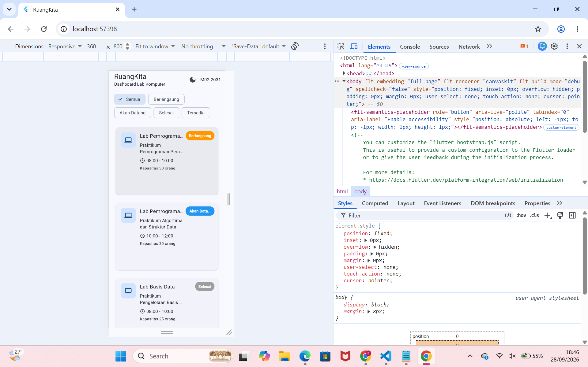
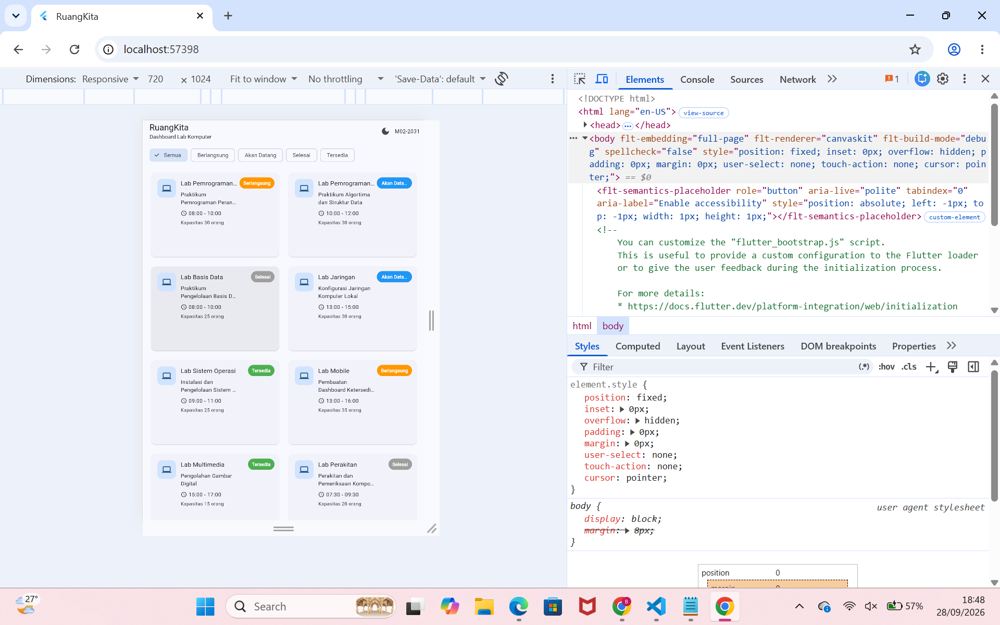
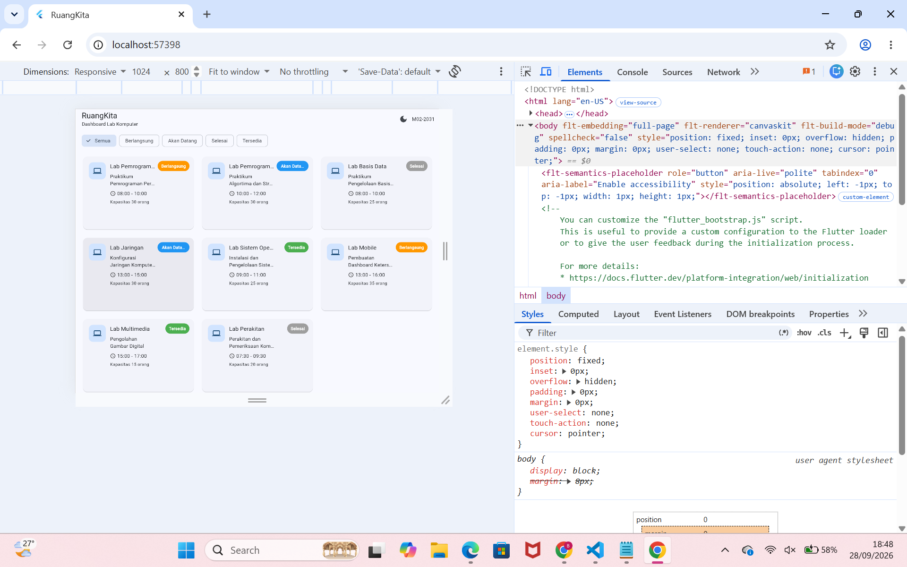
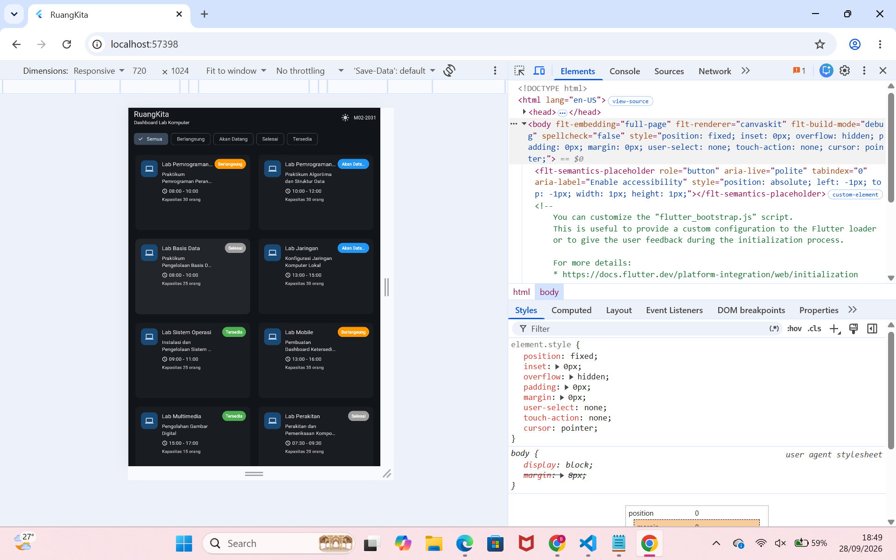

# RuangKita - Dashboard Ketersediaan Lab Komputer

## 1. Identitas

- Nama: Bunga Hendryanda Ramadhani
- NIM: 362558302031
- Digit terakhir NIM: 1
- Nama aplikasi: RuangKita
- Domain aplikasi: Lab Komputer
- Kode UI: M02-2031
- Nama project: 02-week-2-declarative-ui-responsive-layout

## 2. Deskripsi Singkat

RuangKita adalah aplikasi Flutter yang saya buat untuk menampilkan informasi ketersediaan ruang di Lab Komputer.

Aplikasi ini menggunakan data lokal yang berisi beberapa ruangan lab, kegiatan, waktu, status, deskripsi, dan kapasitas ruangan. Aplikasi juga memiliki layout yang dapat berubah sesuai dengan ukuran layar.

Saya membuat aplikasi ini menggunakan Flutter SDK tanpa package UI tambahan.

## 3. Struktur Folder Utama

Struktur folder utama yang saya gunakan adalah:

```text
02-week-2-declarative-ui-responsive-layout/
├── lib/
│   ├── main.dart
│   ├── models/
│   │   └── room_session.dart
│   └── modul02/
│       └── studi_kasus/
│           └── lab_komputer.dart
├── screenshots/
│   ├── 01_mobile_light.png
│   ├── 02_tablet.png
│   ├── 03_expanded.png
│   ├── 04_dark_mode.png
│   └── debug/
├── evidence/
│   └── widget_tree.jpg
├── DEBUG_NOTES.md
├── AI_USAGE.md
├── README.md
├── analysis_options.yaml
└── pubspec.yaml
```

Model data saya pisahkan ke file `room_session.dart`, sedangkan tampilan utama aplikasi ada di file `lab_komputer.dart`.

## 4. Fitur-Fitur Aplikasi

Beberapa fitur yang saya buat di aplikasi RuangKita yaitu:

- Menggunakan model data `RoomSession`.
- Menggunakan data lokal untuk menampilkan data Lab Komputer.
- Memiliki status `Berlangsung`, `Akan Datang`, `Selesai`, dan `Tersedia`.
- Halaman utama menggunakan `StatefulWidget`.
- Filter status menggunakan `Wrap`, `ChoiceChip`, dan `setState()`.
- Layout aplikasi menyesuaikan ukuran layar menggunakan `LayoutBuilder`.
- Card menggunakan `Card`, `InkWell`, `Row`, `Column`, dan `Expanded`.
- Badge status menggunakan `Stack` dan `Positioned`.
- Badge status ditampilkan di kanan atas card.
- Teks panjang menggunakan `maxLines` dan `TextOverflow.ellipsis`.
- Card dapat ditekan untuk membuka `showModalBottomSheet`.
- Bottom sheet memiliki switch dengan tulisan `Ingatkan saya`.
- Menggunakan Material 3 dengan `ThemeData(useMaterial3: true)`.
- Menggunakan `ColorScheme.fromSeed`.
- Memiliki Light Mode dan Dark Mode.
- Kode UI `M02-2031` ditampilkan di AppBar.
- Menggunakan `Center` dan `ConstrainedBox` supaya card tidak terlalu lebar pada tampilan web.
- Aplikasi dibuat menggunakan Flutter SDK tanpa package UI tambahan.

## 5. Penggunaan StatefulWidget

Saya menggunakan `StatefulWidget` pada halaman utama karena ada beberapa bagian tampilan yang dapat berubah saat aplikasi digunakan.

Contohnya adalah:

- Filter status.
- Light Mode dan Dark Mode.
- Switch `Ingatkan saya` pada bottom sheet.

Saat pengguna memilih filter, nilai filter berubah menggunakan `setState()`. Setelah itu, daftar card yang ditampilkan juga ikut berubah tanpa perlu menjalankan ulang aplikasi.

Menurut saya, `StatefulWidget` cocok digunakan karena tampilan halaman perlu berubah berdasarkan interaksi pengguna.

## 6. Responsive Layout

Saya membuat layout yang berbeda berdasarkan ukuran layar menggunakan `LayoutBuilder`.

Jumlah kolom ditentukan berdasarkan nilai `constraints.maxWidth`.

| Ukuran layar | Jumlah kolom | Widget yang digunakan | Alasan |
|---|---:|---|---|
| Kurang dari 600 dp | 1 kolom | `LayoutBuilder`, `GridView`, `Card` | Supaya card tetap nyaman dibaca pada layar HP. |
| 600 sampai 839 dp | 2 kolom | `LayoutBuilder`, `GridView`, `Card` | Memanfaatkan ruang tablet tanpa membuat card terlalu sempit. |
| 840 dp atau lebih | 3 kolom | `LayoutBuilder`, `GridView`, `Card` | Menampilkan lebih banyak card pada layar yang lebih lebar. |

Pada card saya juga menggunakan `Row`, `Column`, dan `Expanded` supaya isi card dapat menyesuaikan ruang yang tersedia.

Badge status menggunakan `Stack` dan `Positioned` supaya dapat diletakkan di bagian kanan atas card.

Saya juga menggunakan `Center` dan `ConstrainedBox` agar card tidak terlalu lebar ketika aplikasi ditampilkan pada layar web.

## 7. Screenshot

### Mobile - Light Mode

Ukuran layar yang digunakan adalah sekitar 360 x 800. Layout menggunakan satu kolom.



### Tablet

Ukuran layar yang digunakan adalah sekitar 720 x 1024. Layout menggunakan dua kolom.



### Expanded

Ukuran layar yang digunakan adalah sekitar 1024 x 800. Layout menggunakan tiga kolom.



### Dark Mode

Screenshot ini menunjukkan aplikasi ketika Dark Mode sedang digunakan.



## 8. Cara Menjalankan Project

Pastikan terminal sudah berada di folder project:

```bash
cd 02-week-2-declarative-ui-responsive-layout
```

Kemudian jalankan perintah berikut.

### Mengambil dependency

```bash
flutter pub get
```

### Mengecek kode

```bash
flutter analyze
```

### Menjalankan aplikasi

```bash
flutter run
```

Untuk menjalankan aplikasi menggunakan browser Chrome, gunakan:

```bash
flutter run -d chrome
```

## 9. Refleksi

### Mengapa Expanded membantu Text di dalam Row?

Menurut saya, `Expanded` membantu `Text` karena `Text` mendapatkan ruang yang tersedia di dalam `Row`.

Kalau teks terlalu panjang dan tidak diberi batas ruang, teks dapat membuat layout menjadi berantakan atau menyebabkan overflow.

Pada aplikasi saya, saya juga menggunakan `maxLines` dan `TextOverflow.ellipsis` supaya teks panjang tetap berada di dalam card.

Contohnya:

```dart
Expanded(
  child: Text(
    ruangan.waktu,
    maxLines: 1,
    overflow: TextOverflow.ellipsis,
  ),
)
```

### Mengapa LayoutBuilder lebih tepat untuk layout lokal daripada hanya MediaQuery?

Saya memilih `LayoutBuilder` karena saya ingin melihat ukuran ruang yang tersedia pada bagian layout yang sedang dibuat.

Dengan `LayoutBuilder`, saya bisa menggunakan `constraints.maxWidth` untuk menentukan jumlah kolom card. Jadi perubahan layout bisa diterapkan pada bagian yang membutuhkan layout responsif.

Pada aplikasi saya, breakpoint yang digunakan adalah:

- Kurang dari 600 dp menggunakan 1 kolom.
- 600 sampai 839 dp menggunakan 2 kolom.
- 840 dp atau lebih menggunakan 3 kolom.

### Apa yang berubah pada widget tree ketika setState() dipanggil?

Ketika `setState()` dipanggil, Flutter menjalankan kembali `build()` pada `StatefulWidget` tersebut.

Pada aplikasi saya, contohnya ketika pengguna memilih `ChoiceChip`, nilai filter berubah. Setelah `setState()` dipanggil, widget yang bergantung pada nilai filter akan dibangun kembali.

Akibatnya, daftar card menyesuaikan status filter yang dipilih.

## 10. Dokumentasi Tambahan

Saya juga membuat beberapa file tambahan untuk dokumentasi tugas.

### DEBUG_NOTES.md

File ini berisi masalah yang saya alami selama membuat aplikasi dan cara saya memperbaikinya.

Masalah yang saya dokumentasikan yaitu:

- Tombol Light/Dark Mode yang awalnya belum terhubung dengan benar.
- Badge status yang terlalu dekat dengan nama lab.

File:

[DEBUG_NOTES.md](DEBUG_NOTES.md)

### AI_USAGE.md

File ini berisi penjelasan penggunaan AI selama proses pengerjaan tugas.

File:

[AI_USAGE.md](AI_USAGE.md)

### Widget Tree

File ini berisi foto diagram widget tree yang saya buat.

File:

[evidence/widget_tree.jpg](evidence/widget_tree.jpg)

## 11. Commit dan Bukti Proses

Saya menggunakan Git untuk menyimpan proses pengerjaan project.

Beberapa commit yang ada di repository saya:

```text
fb887ff docs(m02): add debug evidence
c30729e docs(m02): add debug evidence
567c069 docs(m02): add responsive running screenshots
46096d6 feat(m02): build responsive lab dashboard
4a35962 Initial commit Week 2 Declarative UI Responsive Layout
```

Untuk melihat seluruh riwayat commit, saya menggunakan perintah:

```bash
git log --oneline
```

Link repository:

[Repository GitHub](https://github.com/bungahr/02-week-2-declarative-ui-responsive-layout)

## 12. Kesimpulan

Saya membuat aplikasi RuangKita untuk menampilkan ketersediaan ruang di Lab Komputer dengan tampilan yang dapat menyesuaikan ukuran layar.

Saya menggunakan `StatefulWidget` untuk bagian yang membutuhkan perubahan state, `ChoiceChip` untuk filter, dan `LayoutBuilder` untuk membuat responsive layout.

Menurut saya, penggunaan `Row`, `Column`, `Expanded`, `Stack`, `Positioned`, dan widget lainnya membantu saya memahami bagaimana widget Flutter mengatur ruang dan menyesuaikan tampilan pada ukuran layar yang berbeda.

Aplikasi ini juga membantu saya memahami cara membuat tampilan Flutter yang dapat digunakan pada mobile, tablet, dan web.
